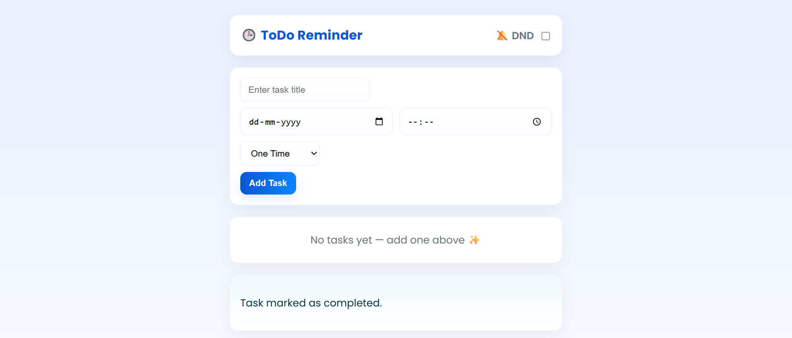

# 🕒 Smart ToDo Reminder App

📖 **Project Story**

I wanted a reminder system that actually *reminds me*.  
Most to-do apps only show silent alerts — no alarms, no repeated notifications, and no proper recurring reminders.  

So I built my own solution 🔥  
That’s how the **Smart ToDo Reminder App** was born.

---

## 🧠 About the Project

This ToDo Reminder App allows users to:

🔹 Add reminders with date, time, and frequency  
🔹 Receive popup alerts at the exact time  
🔹 Hear a real alarm using the official Google alarm sound  
🔹 Snooze reminders for 5 minutes  
🔹 Turn on DND mode to silence notifications  
🔹 Auto-reschedule recurring reminders (Daily, Monthly, Yearly)

A clean UI + real alarm + practical logic makes this much more useful than normal to-do apps.

---

## ⚙️ Tech Stack

**Backend:** Python (Flask)  
**Database:** MySQL  
**Frontend:** HTML, CSS, JavaScript  
**Other:** Google Alarm Sound API, Web Audio API

---

## 🖼️ Screenshots

📌 **Home Page**  

📌 **Reminder Popup**  

📌 **📁 Project Structure** 

---

## 🌟 Highlights

✔ Real alarm that repeats until completed  
✔ Snooze option (5 minutes)  
✔ Clean and centered UI  
✔ Daily / Monthly / Yearly recurring reminders  
✔ Solves a real, everyday problem  

---

## 🧑‍💻 Author

**Naveen Kumar Lebaka**  
Power BI & Python Developer
